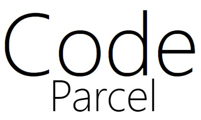

# CodeParcel



## Dev

```bash
npm run dev
```

## Resources

-   [Next.js](https://nextjs.org/docs/getting-started)
-   [Tailwindcss](https://tailwindcss.com/docs)
-   Font - [Nunito](https://fonts.google.com/specimen/Nunito#standard-styles)

## Introduction

This application was made for the 2021 Digital Ocean + MongoDB hackathon.

CodeParcel is an application for community code snippets mixed with code challenges. The aim is to provide other users with helpful code snippets & to solve community provided challenges your own code snippets.

### Sign Up

1. Enter Email
2. Provide UserName
3. Password
4. Confirm Password

### Logging in

1. Enter user name
2. Enter Password

### Create a snippet

1. navigating to the top right corner, click your user name, click dashboard
2. Enter snippet name
3. Write your code in the editor.

#### Add new file

1. click the new file button in the snippet editor & give your desired file the file extension.
